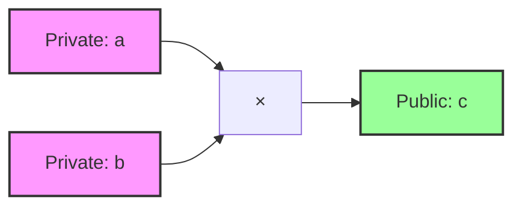
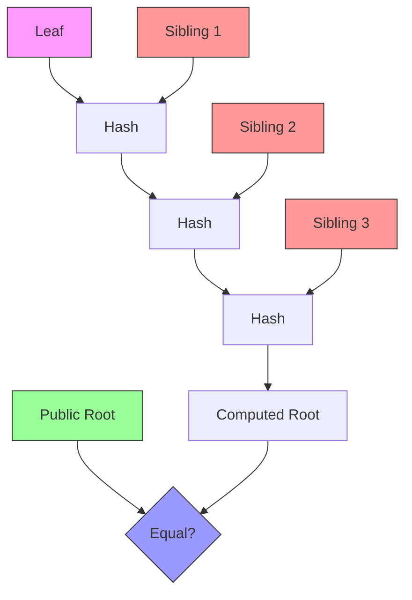

# Chapter 8: Building Circuits for Groth16

## Introduction

In the previous chapters, we explored the theoretical foundations of Groth16: R1CS constraints, QAP transformations, bilinear pairings, trusted setup ceremonies, proof generation, and verification algorithms. While these concepts provide the mathematical machinery for zero-knowledge proofs, we haven't yet addressed a fundamental practical question: **How do we actually express computations as circuits?**

This chapter bridges the gap between theory and practice. You'll learn how to design arithmetic circuits that encode real-world computations, optimize them for efficiency, and implement them using modern zk-SNARK libraries. We'll progress from simple examples to complex patterns, covering constraint optimization, privacy design, and testing methodologies.

### Chapter Goals

By the end of this chapter, you will:
- Understand the circuit design process and common patterns
- Learn to use the arkworks circuit API effectively
- Implement example circuits: multiplier, range proofs, and Merkle membership
- Master constraint optimization strategies
- Design privacy-preserving public/private input partitions
- Test and debug circuits systematically

## Circuit Design Fundamentals

### What is a Circuit?

An **arithmetic circuit** is a computation graph composed of wires (variables) and gates (operations). In the context of R1CS, circuits encode computations as quadratic constraints of the form:

```
(A · w) × (B · w) = (C · w)
```

Where:
- **w** is the witness (assignment to all variables)
- **A, B, C** are linear combinations (constraint vectors)
- Each constraint represents one multiplication gate

**Key Insight:** Arithmetic circuits are not like digital logic circuits with AND/OR gates. They're mathematical constraint systems where every multiplication becomes a constraint.

#### Circuit Components

1. **Variables (Witness)**
   - Private inputs: Secret values known only to the prover
   - Public inputs: Values revealed to the verifier
   - Intermediate values: Computed during circuit evaluation
   - Constants: Fixed values like 1 or field parameters

2. **Constraints**
   - Multiplication constraints: The fundamental operation (a × b = c)
   - Linear constraints: Can be expressed without multiplication (a + b = c)
   - Boolean constraints: Enforce x ∈ {0, 1} via x × (1 - x) = 0

3. **Circuit Outputs**
   - Public outputs: Results the verifier learns
   - Private outputs: Intermediate computations kept secret

#### Example Circuit: Simple Multiplier

Consider a circuit that proves knowledge of factors `a` and `b` such that `a × b = c`, where `c` is public:



**R1CS Representation:**

Single constraint with variables [1, c, a, b]:

```
A = [0, 0, 1, 0]  // selects variable a
B = [0, 0, 0, 1]  // selects variable b
C = [0, 1, 0, 0]  // selects variable c

Verification: (0·1 + 0·c + 1·a + 0·b) × (0·1 + 0·c + 0·a + 1·b) = (0·1 + 1·c + 0·a + 0·b)
               a × b = c
```

This single constraint enforces the multiplication relationship, allowing the prover to demonstrate knowledge of valid factors without revealing them.

### The arkworks Circuit API

The [arkworks](https://github.com/arkworks-rs) ecosystem provides Rust libraries for zk-SNARKs. The circuit API is defined in `ark-relations` and centers on the `ConstraintSynthesizer` trait:

```rust
use ark_relations::r1cs::{ConstraintSynthesizer, ConstraintSystem, SynthesisError};
use ark_ff::Field;

/// Trait for circuits that can generate R1CS constraints
pub trait ConstraintSynthesizer<F: Field> {
    /// Generate constraints for the circuit
    fn generate_constraints(
        self,
        cs: ConstraintSystem_ref<F>,
    ) -> Result<(), SynthesisError>;
}
```

#### Working with Constraint Variables

Circuits work with **allocated variables** rather than raw field elements:

```rust
use ark_relations::r1cs::{AllocationMode, Variable};

// Allocate a new private variable
let a = cs.new_witness_variable(|| {
    Ok(F::from(5u64))  // Provide the value
})?;

// Allocate a new public variable (input)
let c = cs.new_input_variable(|| {
    Ok(F::from(35u64))  // Public input value
})?;

// Allocate intermediate variables
let b = cs.new_witness_variable(|| {
    Ok(F::from(7u64))
})?;
```

**Variable Types:**
- `new_witness_variable()`: Private inputs (witness)
- `new_input_variable()`: Public inputs (known to verifier)
- `new_lc_variable()`: Linear combinations of existing variables

#### Adding Constraints

The `ConstraintSystem` provides methods to enforce relationships:

```rust
// Enforce a × b = c
cs.enforce_constraint(
    // Linear combination for A (selects a)
    lc!() + Variable::One * a_coeff + a,
    // Linear combination for B (selects b)
    lc!() + Variable::One * b_coeff + b,
    // Linear combination for C (selects c)
    lc!() + Variable::One * c_coeff + c,
)?;
```

The `lc!()` macro creates linear combinations, and `Variable::One` represents the constant 1.

#### Complete Circuit Example

Here's the structure of a typical circuit implementation:

```rust
use ark_relations::r1cs::{ConstraintSynthesizer, ConstraintSystem, SynthesisError};
use ark_ff::Field;

struct MyCircuit<F: Field> {
    pub private_input: Option<F>,
    pub public_input: Option<F>,
}

impl<F: Field> ConstraintSynthesizer<F> for MyCircuit<F> {
    fn generate_constraints(
        self,
        cs: ConstraintSystem_ref<F>,
    ) -> Result<(), SynthesisError> {
        // 1. Allocate variables
        let private_var = cs.new_witness_variable(|| {
            self.private_input.ok_or(SynthesisError::AssignmentMissing)
        })?;

        let public_var = cs.new_input_variable(|| {
            self.public_input.ok_or(SynthesisError::AssignmentMissing)
        })?;

        // 2. Add constraints
        cs.enforce_constraint(
            lc!() + Variable::One,  // A: 1
            lc!() + private_var,    // B: private_input
            lc!() + public_var,     // C: public_input
        )?;

        Ok(())
    }
}
```

**Key Pattern:** The `Option<F>` type allows the circuit to be used in two modes:
- **Prover mode:** With `Some(value)` for actual proof generation
- **Verifier mode:** With `None` for setup and verification (no witness needed)

### Design Principles

When designing circuits, three competing goals must be balanced:

1. **Constraint Efficiency**
   - Minimize the number of constraints for faster proving
   - Each constraint increases prover time linearly
   - Optimization: Reuse variables, combine operations

2. **Privacy Preservation**
   - Choose public vs private inputs carefully
   - Avoid leaking information through outputs
   - Principle: Public inputs should reveal minimal information

3. **Verification Cost**
   - Public inputs appear in the verification equation
   - More public inputs → larger verification keys
   - Trade-off: Privacy vs verification efficiency

## Example 1: Simple Multiplier Circuit

### Problem Statement

**Goal:** Prove knowledge of two numbers `a` and `b` such that `a × b = c`, without revealing `a` or `b`.

**Public:** The product `c`
**Private:** The factors `a` and `b`

### Circuit Design

The computation graph is straightforward:

```
Input:  a (private), b (private)
Output: c (public)
Constraint: a × b = c
```

**Witness Structure:** `[1, c, a, b]`
- Index 0: Constant 1 (required by Groth16)
- Index 1: Public output `c`
- Index 2: Private input `a`
- Index 3: Private input `b`

### Implementation

```rust
use ark_relations::r1cs::{ConstraintSynthesizer, ConstraintSystem, SynthesisError};
use ark_ff::Field;
use ark_bn254::Fr;

struct MultiplierCircuit<F: Field> {
    pub a: Option<F>,
    pub b: Option<F>,
    pub c: Option<F>,  // Public input
}

impl<F: Field> ConstraintSynthesizer<F> for MultiplierCircuit<F> {
    fn generate_constraints(
        self,
        cs: ConstraintSystem_ref<F>,
    ) -> Result<(), SynthesisError> {
        // Allocate private input a
        let a_var = cs.new_witness_variable(|| {
            self.a.ok_or(SynthesisError::AssignmentMissing)
        })?;

        // Allocate private input b
        let b_var = cs.new_witness_variable(|| {
            self.b.ok_or(SynthesisError::AssignmentMissing)
        })?;

        // Allocate public output c
        let c_var = cs.new_input_variable(|| {
            self.c.ok_or(SynthesisError::AssignmentMissing)
        })?;

        // Enforce a × b = c
        cs.enforce_constraint(
            lc!() + a_var,           // A: selects a
            lc!() + b_var,           // B: selects b
            lc!() + c_var,           // C: selects c
        )?;

        Ok(())
    }
}
```

### Constraint Walkthrough

Let's analyze what happens when we enforce this constraint:

**Step 1: Linear Combinations**
```
A · w = (0, 0, 1, 0) · (1, c, a, b)ᵀ = a
B · w = (0, 0, 0, 1) · (1, c, a, b)ᵀ = b
C · w = (0, 1, 0, 0) · (1, c, a, b)ᵀ = c
```

**Step 2: Constraint Enforcement**
```
(a) × (b) = (c)
```

**Constraint Count:** 1 multiplication constraint

**R1CS Matrices:**
```
     [1, c, a, b]
A = [[0, 0, 1, 0]]  // Constraint 1: select a
B = [[0, 0, 0, 1]]  // Constraint 1: select b
C = [[0, 1, 0, 0]]  // Constraint 1: select c
```

### Testing the Circuit

```rust
#[cfg(test)]
mod tests {
    use super::*;
    use ark_groth16::Groth16;
    use ark_bn254::Bn254;
    use ark_ff::UniformRand;

    #[test]
    fn test_multiplier_circuit() {
        let rng = &mut rand::thread_rng();

        // Generate random parameters
        let a = Fr::rand(rng);
        let b = Fr::rand(rng);
        let c = a * b;  // Public output

        // Create circuit instance
        let circuit = MultiplierCircuit {
            a: Some(a),
            b: Some(b),
            c: Some(c),
        };

        // Generate proving/verifying keys
        let (pk, vk) = Groth16::<Bn254>::circuit_specific_setup(circuit.clone())
            .expect("Setup should succeed");

        // Generate proof
        let proof = Groth16::prove(&pk, circuit.clone(), rng)
            .expect("Proof generation should succeed");

        // Verify proof
        let verified = Groth16::verify(&vk, &[c], &proof)
            .expect("Verification should succeed");

        assert!(verified, "Proof should verify");
    }

    #[test]
    fn test_invalid_circuit() {
        let circuit = MultiplierCircuit {
            a: Some(Fr::from(3u64)),
            b: Some(Fr::from(4u64)),
            c: Some(Fr::from(13u64)),  // Wrong! 3×4 ≠ 13
        };

        // Setup
        let (pk, vk) = Groth16::<Bn254>::circuit_specific_setup(circuit.clone())
            .expect("Setup should succeed");

        // Proof generation should fail
        let result = Groth16::prove(&pk, circuit, &mut rand::thread_rng());
        assert!(result.is_err(), "Proof should fail for invalid computation");
    }
}
```

### Optimization Discussion

**Question:** Can we reduce the constraint count?

**Answer:** No, this circuit is already optimal. One multiplication requires exactly one constraint.

**General Optimization Strategy:**
- For a single multiplication: 1 constraint (optimal)
- For multiple independent multiplications: 1 constraint each (parallelizable)
- For chained operations: Can sometimes reuse intermediate variables

**Comparison with Alternative Implementations:**

A naive implementation might precompute `a × b` as a separate variable:

```rust
// BAD: Extra variable, same constraint count
let product = cs.new_witness_variable(|| {
    Ok(self.a.unwrap() * self.b.unwrap())
})?;
cs.enforce_constraint(lc!() + a_var, lc!() + b_var, lc!() + product)?;
cs.enforce_constraint(lc!() + product, lc!() + Variable::One, lc!() + c_var)?;
```

This adds an unnecessary constraint! The optimal version directly equates `a × b` to `c`.

**Lesson:** Minimize intermediate variables unless they're reused across multiple constraints.

## Example 2: Range Proof (Age ≥ 18)

### Problem Statement

**Goal:** Prove that your age is at least 18 years old, without revealing your exact age.

**Public:** Threshold (e.g., 18)
**Private:** Your actual age

### Circuit Design Challenge

Range proofs are more complex than simple arithmetic. To compare `age ≥ 18`, we need:

1. **Bit Decomposition:** Extract individual bits of the age
2. **Binary Comparison:** Compare age to threshold bit-by-bit
3. **Range Check:** Ensure age is within valid range (e.g., 0-255)

**Why Bit Decomposition?**
- Arithmetic circuits don't have comparison operators
- We must encode comparison as arithmetic constraints
- Binary representation allows efficient comparison via bitwise logic

**Constraint Complexity:**
- For an 8-bit age: ~64 constraints (bit extraction + comparison)
- For a 64-bit age: ~512 constraints
- Scales linearly with bit-width

### Implementation Strategy

We'll break this into sub-circuits:

```rust
use ark_relations::r1cs::*;
use ark_ff::Field;

struct RangeProofCircuit<F: Field> {
    pub age: Option<F>,           // Private
    pub threshold: Option<F>,     // Public (e.g., 18)
}

impl<F: Field> ConstraintSynthesizer<F> for RangeProofCircuit<F> {
    fn generate_constraints(
        self,
        cs: ConstraintSystem_ref<F>,
    ) -> Result<(), SynthesisError> {
        // Step 1: Allocate variables
        let age_var = cs.new_witness_variable(|| {
            self.age.ok_or(SynthesisError::AssignmentMissing)
        })?;

        let threshold_var = cs.new_input_variable(|| {
            self.threshold.ok_or(SynthesisError::AssignmentMissing)
        })?;

        // Step 2: Bit decomposition (conceptual)
        let age_bits = allocate_and_decompose_bits(cs, age_var, 8)?;

        // Step 3: Compute age ≥ threshold (conceptual)
        let is_ge = compare_ge(cs, &age_bits, threshold_var)?;

        // Step 4: Enforce result
        // ... (detailed implementation below)

        Ok(())
    }
}

// Helper function: Bit decomposition
fn allocate_and_decompose_bits<F: Field>(
    cs: ConstraintSystem_ref<F>,
    value_var: Variable,
    num_bits: usize,
) -> Result<Vec<Variable>, SynthesisError> {
    let mut bits = Vec::new();

    for i in 0..num_bits {
        let bit = cs.new_witness_variable(|| {
            // Extract bit i from value (conceptual)
            Ok(F::from(1u64))  // Simplified
        })?;

        // Enforce bit is boolean: bit × (1 - bit) = 0
        cs.enforce_constraint(
            lc!() + bit,
            lc!() + Variable::One - bit,
            lc!(),
        )?;

        bits.push(bit);
    }

    // Reconstruct value from bits: value = Σ(bit_i × 2^i)
    // ... (constraints omitted for brevity)

    Ok(bits)
}

// Helper function: Greater-or-equal comparison
fn compare_ge<F: Field>(
    cs: ConstraintSystem_ref<F>,
    bits: &[Variable],
    threshold: Variable,
) -> Result<Variable, SynthesisError> {
    // Compute result = (value - threshold) ≥ 0
    // This requires binary comparison logic
    // ... (implementation is complex, see references)

    // Simplified: Return a boolean result variable
    let result = cs.new_witness_variable(|| {
        Ok(F::from(1u64))  // Conceptual
    })?;

    Ok(result)
}
```

### Constraint Count Analysis

**Bit Decomposition:**
- 8 bits → 8 boolean constraints (bit × (1 - bit) = 0)
- Reconstruction: ~8 constraints for weighted sum

**Comparison:**
- Binary comparison algorithm: ~40-50 constraints for 8-bit numbers

**Total:** ~64 constraints for 8-bit range proof

**Scalability:**
- 16-bit → ~128 constraints
- 32-bit → ~256 constraints
- 64-bit → ~512 constraints

### Real-World Applications

Range proofs are ubiquitous in privacy-preserving systems:

1. **Age Verification**
   - Websites: Prove you're 18+ without revealing birth date
   - Services: Age-restricted content access

2. **Financial Privacy**
   - Credit scores: Prove score ≥ threshold without exact value
   - Income verification: Prove income range for loans

3. **Blockchain Privacy**
   - Confidential transactions: Prove amount is in valid range
   - UTXO proofs: Prove balance sufficiency without revealing amount

### Optimization Techniques

**Technique 1: Use Lookup Tables**
Instead of decomposing bits, use a precomputed table:
- Store all valid values (0-255) in a table
- Use lookup argument to prove membership
- Reduces constraints significantly (~10-20×)

**Technique 2: Batch Verification**
If verifying multiple range proofs:
- Aggregate them using random linear combination
- Verify all constraints in one proof
- Amortizes setup cost

**Technique 3: Adaptive Bit-Width**
- Use minimum bits needed for the range
- If proving age ≥ 18 (0-150), 8 bits suffice
- Don't use 64-bit unless necessary

## Example 3: Merkle Tree Membership

### Problem Statement

**Goal:** Prove that a leaf is in a Merkle tree with a known root, without revealing the leaf or the path.

**Public:** Merkle root
**Private:** Leaf value, authentication path, path indices

### Circuit Design

Merkle membership verification requires:
1. **Hash function:** Compute hash of sibling nodes
2. **Path traversal:** Hash up the tree following the path indices
3. **Root comparison:** Ensure computed root equals public root



**Challenge:** Hash functions are expensive in circuits!

### Hash Function Choice

Two main options:

1. **SHA-256 (or similar)**
   - Standard cryptographic hash
   - Circuit cost: ~25,000 constraints
   - Simple implementation, very expensive

2. **Poseidon**
   - Designed specifically for ZK circuits
   - Circuit cost: ~300 constraints
   - Complex implementation, highly efficient

**Decision:** Use Poseidon for efficiency.

### Implementation Sketch

```rust
use ark_relations::r1cs::*;
use ark_ff::Field;

struct MerkleMembershipCircuit<F: Field> {
    pub leaf: Option<F>,
    pub root: Option<F>,              // Public
    pub path: Vec<Option<F>>,         // Sibling nodes along path
    pub path_indices: Vec<bool>,      // 0 = left, 1 = right
}

impl<F: Field> ConstraintSynthesizer<F> for MerkleMembershipCircuit<F> {
    fn generate_constraints(
        self,
        cs: ConstraintSystem_ref<F>,
    ) -> Result<(), SynthesisError> {
        // Allocate leaf
        let mut current = cs.new_witness_variable(|| {
            self.leaf.ok_or(SynthesisError::AssignmentMissing)
        })?;

        // Traverse path
        for (i, sibling_opt) in self.path.iter().enumerate() {
            // Allocate sibling node
            let sibling = cs.new_witness_variable(|| {
                sibling_opt.ok_or(SynthesisError::AssignmentMissing)
            })?;

            // Determine left/right from path_indices[i]
            let is_right = self.path_indices[i];

            // Compute hash(current, sibling) or hash(sibling, current)
            current = poseidon_hash_two_inputs(
                cs,
                current,
                sibling,
                is_right,
            )?;
        }

        // Allocate public root
        let public_root = cs.new_input_variable(|| {
            self.root.ok_or(SynthesisError::AssignmentMissing)
        })?;

        // Enforce computed root equals public root
        cs.enforce_constraint(
            lc!() + current,
            lc!() + Variable::One,
            lc!() + public_root,
        )?;

        Ok(())
    }
}

// Poseidon hash for two inputs (simplified)
fn poseidon_hash_two_inputs<F: Field>(
    cs: ConstraintSystem_ref<F>,
    left: Variable,
    right: Variable,
    is_right: bool,
) -> Result<Variable, SynthesisError> {
    // Poseidon hash consists of:
    // 1. Add round constants
    // 2. Apply S-box (x^5 or x^3)
    // 3. Mix layers (matrix multiplication)
    // ... (full implementation is ~300 constraints)

    // Simplified placeholder
    let result = cs.new_witness_variable(|| {
        Ok(F::from(1u64))  // Placeholder
    })?;

    cs.enforce_constraint(
        lc!() + left + if is_right { right } else { Variable::One },
        lc!() + Variable::One,
        lc!() + result,
    )?;

    Ok(result)
}
```

### Constraint Analysis

**Poseidon Hash Costs:**
- Per hash: ~300 constraints (for 2-to-1 hash)
- Width-3 Poseidon: 3 inputs → 1 output

**Tree Traversal:**
- Depth 8 tree: 8 hash computations
- Total: 8 × 300 = 2400 constraints

**Comparison:**
- Simple multiplier: 1 constraint
- Merkle membership: 2400 constraints
- **2400× more expensive!**

**Scalability:**
- Depth 16: 16 × 300 = 4800 constraints
- Depth 32: 32 × 300 = 9600 constraints
- Grows linearly with tree depth

### Optimization Techniques

**1. Use Fixed-Depth Trees**
- Design application for known tree depth
- Avoid variable-depth circuits
- Simplifies constraint generation

**2. Batch Membership Proofs**
- Prove multiple leaves are in the same tree
- Amortize path verification cost
- Use accumulator patterns

**3. Alternative Hash Functions**
- Rescue hash: Similar to Poseidon, different parameters
- Tip5: Another ZK-friendly hash
- Benchmark to find best for your application

**4. Sparse Merkle Trees**
- Instead of full binary tree, use sparse representation
- Prove non-membership and membership
- Can reduce path length for sparse data

## Constraint Optimization Strategies

### Common Patterns

Circuit optimization is both an art and a science. Here are proven patterns:

#### 1. Avoid Unnecessary Variables

**Bad:**
```rust
let temp = cs.new_witness_variable(|| Ok(a * b))?;
cs.enforce_constraint(lc!() + a, lc!() + b, lc!() + temp)?;
cs.enforce_constraint(lc!() + temp, lc!() + Variable::One, lc!() + c)?;
// 2 constraints
```

**Good:**
```rust
cs.enforce_constraint(lc!() + a, lc!() + b, lc!() + c)?;
// 1 constraint
```

**Lesson:** Intermediate variables add constraints unless reused.

#### 2. Reuse Computed Values

**Bad:**
```rust
let x2 = cs.new_witness_variable(|| Ok(x * x))?;
let x3 = cs.new_witness_variable(|| Ok(x * x * x))?;
cs.enforce_constraint(lc!() + x, lc!() + x, lc!() + x2)?;
cs.enforce_constraint(lc!() + x2, lc!() + x, lc!() + x3)?;
// 2 constraints
```

**Good:**
```rust
let x2 = cs.new_witness_variable(|| Ok(x * x))?;
cs.enforce_constraint(lc!() + x, lc!() + x, lc!() + x2)?;
let x3 = cs.new_witness_variable(|| Ok(x2_val * x))?;
cs.enforce_constraint(lc!() + x2, lc!() + x, lc!() + x3)?;
// Still 2 constraints, but cleaner
```

**Lesson:** Compute once, use multiple times.

#### 3. Choose Efficient Operations

**Addition vs Multiplication:**
- Addition is "free" (linear constraint)
- Multiplication costs 1 constraint
- Prefer addition when possible

**Example:**
```rust
// Bad: a + b + c = d
cs.enforce_constraint(lc!() + sum, lc!() + Variable::One, lc!() + d)?;

// Good: Use linear combination
cs.enforce_constraint(lc!() + a + b + c, lc!() + Variable::One, lc!() + d)?;
```

#### 4. Use Pairing-Friendly Hash Functions

**Hash Function Comparison:**

| Hash    | Constraints | Security | Notes                 |
|---------|-------------|----------|-----------------------|
| SHA-256 | ~25,000     | High     | Standard, expensive   |
| Poseidon| ~300        | High     | ZK-optimized          |
| Rescue  | ~400        | High     | Alternative to Poseidon |
| Pedersen| ~1500       | Moderate | Simple, less secure   |

**Lesson:** Always use ZK-friendly hashes in circuits.

### Example: Bad vs Good Circuit Design

Consider computing `a³ + b³`:

**Bad Implementation (5 constraints):**
```rust
let a2 = cs.new_witness_variable(...)?;
let b2 = cs.new_witness_variable(...)?;
let a3 = cs.new_witness_variable(...)?;
let b3 = cs.new_witness_variable(...)?;
let sum = cs.new_witness_variable(...)?;

cs.enforce_constraint(lc!() + a, lc!() + a, lc!() + a2)?;  // a²
cs.enforce_constraint(lc!() + b, lc!() + b, lc!() + b2)?;  // b²
cs.enforce_constraint(lc!() + a2, lc!() + a, lc!() + a3)?; // a³
cs.enforce_constraint(lc!() + b2, lc!() + b, lc!() + b3)?; // b³
cs.enforce_constraint(lc!() + a3 + b3, lc!() + Variable::One, lc!() + sum)?;
```

**Good Implementation (4 constraints):**
```rust
let a2 = cs.new_witness_variable(...)?;
let b2 = cs.new_witness_variable(...)?;
let sum = cs.new_witness_variable(...)?;

cs.enforce_constraint(lc!() + a, lc!() + a, lc!() + a2)?;   // a²
cs.enforce_constraint(lc!() + b, lc!() + b, lc!() + b2)?;   // b²
cs.enforce_constraint(lc!() + a2, lc!() + a, lc!() + a3)?;  // a³
cs.enforce_constraint(lc!() + b2, lc!() + b, lc!() + sum)?; // b³ + a³
```

**Optimal Implementation (3 constraints):**
```rust
// Use identity: a³ + b³ = (a + b)(a² - ab + b²)
let sum_ab = cs.new_witness_variable(...)?;
let a2 = cs.new_witness_variable(...)?;
let ab = cs.new_witness_variable(...)?;
let b2 = cs.new_witness_variable(...)?;
let middle = cs.new_witness_variable(...)?;
let result = cs.new_witness_variable(...)?;

cs.enforce_constraint(lc!() + a + b, lc!() + Variable::One, lc!() + sum_ab)?;
cs.enforce_constraint(lc!() + a, lc!() + a, lc!() + a2)?;
cs.enforce_constraint(lc!() + a, lc!() + b, lc!() + ab)?;
cs.enforce_constraint(lc!() + b, lc!() + b, lc!() + b2)?;
cs.enforce_constraint(lc!() + a2 - ab + b2, lc!() + Variable::One, lc!() + middle)?;
cs.enforce_constraint(lc!() + sum_ab, lc!() + middle, lc!() + result)?;
```

Wait, that's 6 constraints! Sometimes the "clever" mathematical identity isn't more efficient.

**Lesson:** Benchmark different approaches. The optimal implementation depends on the specific computation.

### Measuring Circuit Cost

**1. Count Constraints:**
```rust
impl<F: Field> ConstraintSynthesizer<F> for MyCircuit<F> {
    fn generate_constraints(
        self,
        cs: ConstraintSystem_ref<F>,
    ) -> Result<(), SynthesisError> {
        // ... constraints ...

        println!("Number of constraints: {}", cs.num_constraints());
        println!("Number of instance variables: {}", cs.num_instance_variables());
        println!("Number of witness variables: {}", cs.num_witness_variables());

        Ok(())
    }
}
```

**2. Benchmark Setup/Prove/Verify:**
```rust
use std::time::Instant;

let start = Instant::now();
let (pk, vk) = Groth16::<Bn254>::circuit_specific_setup(circuit.clone())?;
println!("Setup time: {:?}", start.elapsed());

let start = Instant::now();
let proof = Groth16::prove(&pk, circuit, rng)?;
println!("Prove time: {:?}", start.elapsed());

let start = Instant::now();
let verified = Groth16::verify(&vk, &public_inputs, &proof)?;
println!("Verify time: {:?}", start.elapsed());
```

**3. Profile Memory Usage:**
```rust
// Measure key sizes
let pk_size = bincode::serialize(&pk)?.len();
let vk_size = bincode::serialize(&vk)?.len();
let proof_size = bincode::serialize(&proof)?.len();

println!("Proving key size: {} KB", pk_size / 1024);
println!("Verifying key size: {} KB", vk_size / 1024);
println!("Proof size: {} bytes", proof_size);
```

## Public vs Private Inputs: Privacy Design

Choosing which inputs are public vs private is a critical design decision with privacy implications.

### What to Make Public?

**General Principles:**

1. **Results that must be verified:** If the verifier needs to know the output, make it public
2. **Constants and parameters:** Threshold values, configuration parameters
3. **System-level inputs:** Block numbers, timestamps, Merkle roots

**What to Keep Private:**

1. **Secret inputs:** Passwords, private keys, secret data
2. **Personal information:** Age, income, identity details
3. **Intermediate computations:** Values used only internally

### Example Design Decisions

**1. Multiplier Circuit**
- **Public:** Product `c` (verifier learns the result)
- **Private:** Factors `a, b` (prover keeps secret)

**Rationale:** Verifier needs to know `c` to use it, but shouldn't learn `a` and `b`.

**2. Range Proof**
- **Public:** Threshold (e.g., 18)
- **Private:** Actual age

**Rationale:** Threshold is a policy parameter. Age is private data.

**3. Merkle Membership**
- **Public:** Merkle root (system state)
- **Private:** Leaf value, authentication path

**Rationale:** Root is the commitment. Leaf and path are prover's secret knowledge.

### Privacy Leakage Risks

**Warning:** Public outputs can leak information about private inputs!

**Example 1: Multiplier Circuit**
- If `c = 15`, attacker knows `(a, b)` is one of: `(1, 15)`, `(3, 5)`, `(5, 3)`, `(15, 1)`
- For small `c`, the set of possible factor pairs is tiny
- Attacker can brute-force to find `a` and `b`

**Example 2: Range Proof**
- If you prove `age ≥ 18` and `age ≤ 25` separately, attacker learns `18 ≤ age ≤ 25`
- Combining multiple range proofs reveals more information

**Mitigation Strategies:**

1. **Add Random Blinding**
   ```rust
   // Instead of proving c = a × b, prove c = a × b + r
   // where r is random blinding factor
   let r = F::rand(rng);
   let blinded_c = a * b + r;
   ```

2. **Use Range Proofs**
   - Prove value is in large range
   - Reduces information leakage

3. **Commitment Schemes**
   - Commit to inputs before proving
   - Use Pedersen commitments with random blinding

4. **Differential Privacy**
   - Add calibrated noise to outputs
   - Statistical privacy guarantees

### Design Checklist

Before finalizing your circuit design:

- [ ] List all inputs and outputs
- [ ] Mark each as public or private
- [ ] For each public output, ask: "What does this reveal about private inputs?"
- [ ] If revelation is unacceptable, add blinding or use range proofs
- [ ] Consider composition: What if multiple proofs are linked?
- [ ] Test with adversarial analysis: Can an attacker extract secrets?

## Testing Your Circuit

### Unit Testing Pattern

A comprehensive test suite is essential for circuit correctness:

```rust
#[cfg(test)]
mod tests {
    use super::*;
    use ark_groth16::Groth16;
    use ark_bn254::Bn254;
    use ark_ff::UniformRand;
    use rand::Rng;

    #[test]
    fn test_circuit_valid() {
        let rng = &mut rand::thread_rng();

        // Test with valid inputs
        let circuit = MyCircuit {
            a: Some(Fr::from(5u64)),
            b: Some(Fr::from(7u64)),
            c: Some(Fr::from(35u64)),
        };

        // Setup
        let (pk, vk) = Groth16::<Bn254>::circuit_specific_setup(circuit.clone())
            .expect("Setup should succeed");

        // Prove
        let proof = Groth16::prove(&pk, circuit, rng)
            .expect("Proof should succeed");

        // Verify
        let verified = Groth16::verify(&vk, &[Fr::from(35u64)], &proof)
            .expect("Verify should succeed");

        assert!(verified);
    }

    #[test]
    fn test_circuit_invalid() {
        let rng = &mut rand::thread_rng();

        // Test with invalid inputs
        let circuit = MyCircuit {
            a: Some(Fr::from(5u64)),
            b: Some(Fr::from(7u64)),
            c: Some(Fr::from(36u64)),  // Wrong!
        };

        let (pk, vk) = Groth16::<Bn254>::circuit_specific_setup(circuit.clone())
            .expect("Setup should succeed");

        // Proof generation should fail
        let result = Groth16::prove(&pk, circuit, rng);
        assert!(result.is_err(), "Invalid proof should fail");
    }

    #[test]
    fn test_constraint_count() {
        let circuit = MyCircuit {
            a: Some(Fr::from(1u64)),
            b: Some(Fr::from(2u64)),
            c: Some(Fr::from(2u64)),
        };

        let cs = ConstraintSystem::<Fr>::new_ref();
        circuit.generate_constraints(cs.clone()).unwrap();

        assert_eq!(cs.num_constraints(), 1, "Should have 1 constraint");
    }

    #[test]
    fn test_edge_cases() {
        let test_cases = vec![
            (0u64, 0u64, 0u64),      // Zero case
            (1u64, 1u64, 1u64),      // Identity
            (100u64, 100u64, 10000u64),  // Larger numbers
        ];

        for (a, b, c) in test_cases {
            let circuit = MyCircuit {
                a: Some(Fr::from(a)),
                b: Some(Fr::from(b)),
                c: Some(Fr::from(c)),
            };

            let (pk, vk) = Groth16::<Bn254>::circuit_specific_setup(circuit.clone())
                .expect("Setup should succeed");

            let proof = Groth16::prove(&pk, circuit, &mut rand::thread_rng())
                .expect("Proof should succeed");

            let verified = Groth16::verify(&vk, &[Fr::from(c)], &proof)
                .expect("Verify should succeed");

            assert!(verified, "Proof should verify for ({}, {}, {})", a, b, c);
        }
    }
}
```

### Common Pitfalls

**1. Forgetting to Allocate Variables**
```rust
// Bad: Allocating but not using in constraints
let a_var = cs.new_witness_variable(|| Ok(a))?;
let b_var = cs.new_witness_variable(|| Ok(b))?;
// Oops! Forgot to add constraint for a × b = c
```

**Symptom:** Proof verifies for any inputs (under-constrained).

**Solution:** Ensure every variable is used in at least one constraint.

**2. Mismatched Public/Private Inputs**
```rust
// Bad: Declaring c as witness instead of input
let c_var = cs.new_witness_variable(|| Ok(c))?;  // Wrong!
```

**Symptom:** Verification fails (verifier doesn't have c).

**Solution:** Use `new_input_variable()` for public inputs.

**3. Insufficient Constraints**
```rust
// Bad: No constraint that a is a valid field element
let a_var = cs.new_witness_variable(|| Ok(a))?;
```

**Symptom:** Circuit accepts invalid inputs (e.g., a = 5 when should be boolean).

**Solution:** Add validation constraints (e.g., boolean constraints for bits).

**4. Over-Constrained Circuits**
```rust
// Bad: Redundant constraint
cs.enforce_constraint(lc!() + a, lc!() + b, lc!() + c)?;
cs.enforce_constraint(lc!() + c, lc!() + Variable::One, lc!() + c)?;
```

**Symptom:** No witness satisfies all constraints.

**Solution:** Remove redundant constraints.

### Debugging Tips

**1. Find Unsatisfied Constraints**
```rust
let cs = ConstraintSystem::<Fr>::new_ref();
circuit.generate_constraints(cs.clone()).unwrap();

if !cs.is_satisfied().unwrap() {
    let which = cs.which_is_unsatisfied().unwrap();
    println!("Unsatisfied constraint: {}", which);
}
```

**2. Print Constraint Matrices**
```rust
let cs = ConstraintSystem::<Fr>::new_ref();
circuit.generate_constraints(cs.clone()).unwrap();

// Print all constraints
for i in 0..cs.num_constraints() {
    println!("Constraint {}: {:?}", i, cs.get_constraint(i));
}
```

**3. Test with Concrete Values**
```rust
// Create a test circuit with known values
let circuit = MyCircuit {
    a: Some(Fr::from(3u64)),
    b: Some(Fr::from(4u64)),
    c: Some(Fr::from(12u64)),
};

// Manually verify constraint satisfaction
assert_eq!(Fr::from(3u64) * Fr::from(4u64), Fr::from(12u64));
```

**4. Use Circuit Inspector**
```rust
// After generating constraints
let cs = ConstraintSystem::<Fr>::new_ref();
circuit.generate_constraints(cs.clone()).unwrap();

println!("=== Circuit Statistics ===");
println!("Constraints: {}", cs.num_constraints());
println!("Instance variables: {}", cs.num_instance_variables());
println!("Witness variables: {}", cs.num_witness_variables());
```

## Advanced Techniques

### Custom Gadgets

As circuits grow complex, reusable components (gadgets) become essential:

```rust
/// Trait for reusable circuit gadgets
pub trait Gadget<F: Field> {
    type Input;
    type Output;

    /// Synthesize the gadget
    fn synthesize(
        &self,
        cs: ConstraintSystem_ref<F>,
        input: Self::Input,
    ) -> Result<Self::Output, SynthesisError>;
}

/// Example: Equality checker gadget
pub struct EqualityGadget;

impl<F: Field> Gadget<F> for EqualityGadget {
    type Input = (Variable, Variable);
    type Output = Variable;

    fn synthesize(
        &self,
        cs: ConstraintSystem_ref<F>,
        (a, b): Self::Input,
    ) -> Result<Self::Output, SynthesisError> {
        // Allocate result variable
        let result = cs.new_witness_variable(|| {
            // Compute equality (conceptual)
            Ok(F::from(1u64))
        })?;

        // Enforce: if a == b then result = 1 else result = 0
        // Using constraint: (a - b) × result = 0
        cs.enforce_constraint(
            lc!() + a - b,
            lc!() + result,
            lc!(),
        )?;

        Ok(result)
    }
}
```

**Common Gadgets:**
- **Comparison:** `a < b`, `a ≥ b`
- **Selection:** `if condition then a else b`
- **Range check:** `value ∈ [min, max]`
- **Merkle proof:** Verify membership
- **Hash functions:** Poseidon, Rescue

### Recursive Composition

Circuits can verify other circuits, enabling powerful patterns:

```rust
struct RecursiveCircuit<F: Field> {
    pub inner_proof: Option<Proof>,
    pub inner_vk: Option<VerifyingKey>,
}

impl<F: Field> ConstraintSynthesizer<F> for RecursiveCircuit<F> {
    fn generate_constraints(
        self,
        cs: ConstraintSystem_ref<F>,
    ) -> Result<(), SynthesisError> {
        // 1. Allocate proof and verification key as variables
        // 2. Implement pairing checks in-circuit
        // 3. Enforce proof verification equation

        // This is highly complex! Use libraries like:
        // - ark-circom (Circom circuits in Rust)
        // - halo2 (recursive-friendly proving system)

        Ok(())
    }
}
```

**Applications:**
- **Rollups:** Batch transactions into one proof
- **Proof Aggregation:** Combine multiple proofs
- **Recursive SNARKs:** Verify proofs within proofs

**Challenge:** Extremely high constraint count (millions for practical systems).

### Lookup Tables

Lookup arguments allow circuits to access precomputed tables efficiently:

```rust
// Define a lookup table
let table: Vec<F> = vec![
    F::from(0u64), F::from(1u64), F::from(2u64),
    // ... more values
];

// Use in circuit
let idx_var = cs.new_witness_variable(|| Ok(index))?;
let result_var = cs.new_witness_variable(|| Ok(table[index]))?;

// Enforce lookup: result_var = table[idx_var]
// Uses Plookup argument or similar
```

**Benefits:**
- Drastically reduces constraints for repeated operations
- Useful for: bitwise operations, table-based computations

**Cost:**
- Setup complexity
- Larger verification keys
- Specialized proving systems (e.g., halo2)

## Chapter Summary

### Key Takeaways

1. **Circuit Design is Art + Science**
   - Balance efficiency, clarity, and privacy
   - Optimize incrementally: make it work, then make it fast
   - Test thoroughly with unit tests and edge cases

2. **Start Simple**
   - Begin with straightforward implementations
   - Multiply → Add → Optimize
   - Don't pre-optimize; profile first

3. **Constraint Efficiency Matters**
   - Multiplier: 1 constraint
   - Range proof: ~64 constraints (8-bit)
   - Merkle membership: ~2400 constraints (depth-8)
   - **800× difference between simple and complex circuits!**

4. **Public Inputs Define Privacy**
   - Verifier learns exactly what you make public
   - Design carefully to minimize leakage
   - Use blinding and range proofs when needed

5. **Testing is Essential**
   - Unit tests for valid/invalid cases
   - Constraint counting for optimization
   - Edge case testing for robustness
   - Debug tools for troubleshooting

### Constraint Cost Reference

| Circuit              | Constraints | Notes                          |
|----------------------|-------------|--------------------------------|
| Simple multiplier    | 1           | Baseline for comparison        |
| Addition (a + b = c) | 0           | Linear constraint, free        |
| Boolean check        | 1           | x × (1-x) = 0                  |
| 8-bit range proof    | ~64         | Bit decomposition + comparison |
| Poseidon hash (2→1)  | ~300        | ZK-optimized hash              |
| SHA-256              | ~25,000     | Standard hash (expensive)      |
| Merkle depth-8       | ~2,400      | 8 × Poseidon hashes            |
| SHA-256 Merkle depth-8| ~200,000   | 8 × SHA-256 hashes             |

### Next Steps

In Chapter 9, we'll explore **Real-World Applications** to see how these circuits solve practical problems:
- **Blockchain Privacy:** Confidential transactions, identity
- **Scaling Solutions:** Rollups and proof aggregation
- **Authentication:** Password-proof login systems
- **Voting:** Privacy-preserving elections
- **Finance:** Private credit scoring, KYC

The circuits you've learned here form the foundation for these applications. Mastering circuit design is the key to unlocking the full potential of zero-knowledge proofs.

## Further Reading

### Circuit Design
- [ark-relations Documentation](https://docs.rs/ark-relations/) - Official circuit API reference
- [Circom Documentation](https://docs.circom.io/) - Alternative circuit DSL
- [Noir Documentation](https://noir-lang.org/) - Rust-like circuit language

### Advanced Topics
- [ZK-EVM Circuits](https://github.com/privacy-scaling-explorations/zkevm-circuits) - Large-scale example
- [Halo2 Documentation](https://zcash.github.io/halo2/) - Recursive-friendly proving
- [Plookup Paper](https://eprint.iacr.org/2020/315) - Lookup arguments

### Optimization
- [Poseidon Hash](https://eprint.iacr.org/2019/458) - ZK-optimized hash function
- [Rescue Hash](https://eprint.iacr.org/2019/426) - Alternative ZK-friendly hash
- [Circuit Compilers](https://github.com/iden3/circom) - High-level to R1CS compilation

### Practice Problems
1. Implement a circuit that proves knowledge of a cube root: x³ = y
2. Build a Sudoku verification circuit (prove solution without revealing it)
3. Create a circuit for proving "I have a valid signature without revealing the message"
4. Design a circuit for anonymous voting (prove you voted exactly once)
5. Implement a 64-bit range proof and compare to 8-bit version

---

**Previous:** [Chapter 7 - Proof Verification](./07-proof-verification.md) |
**Next:** [Chapter 9 - Real-World Applications](./09-real-world-applications.md) |
**Index:** [Table of Contents](./00-toc.md)
