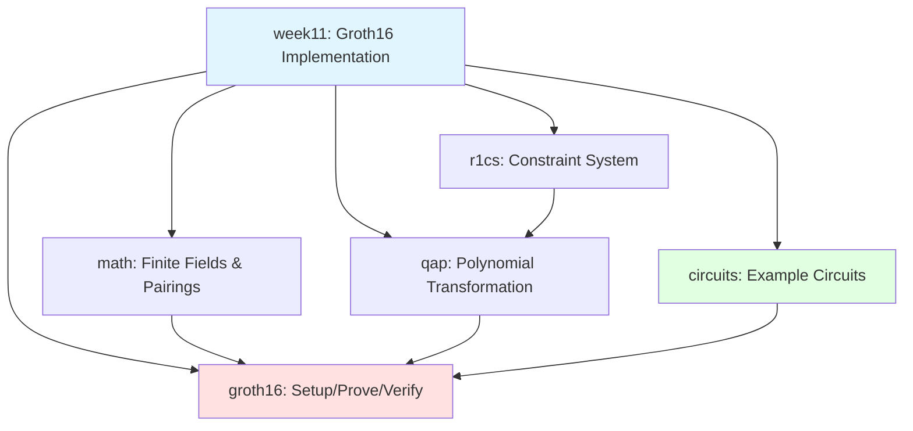
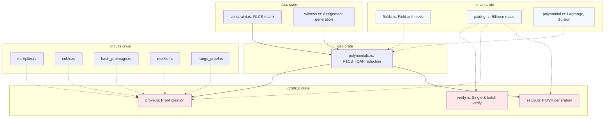
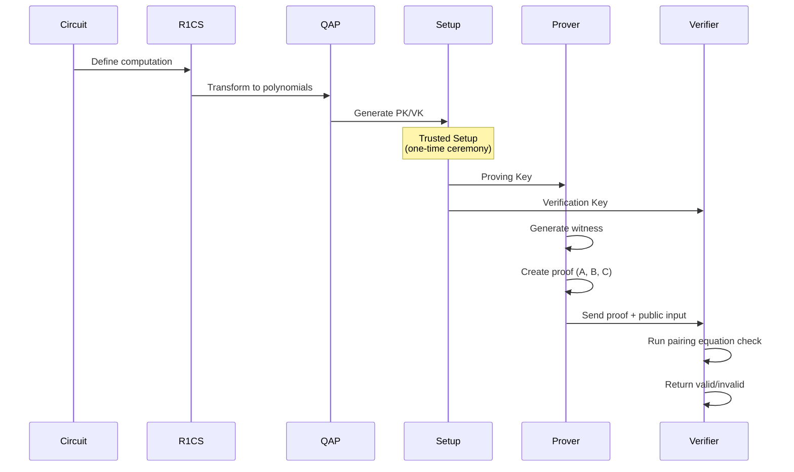
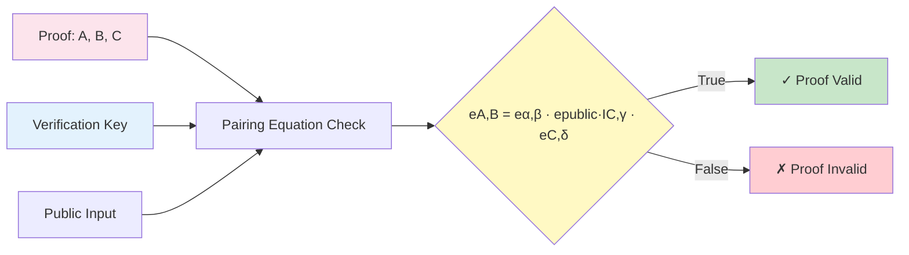
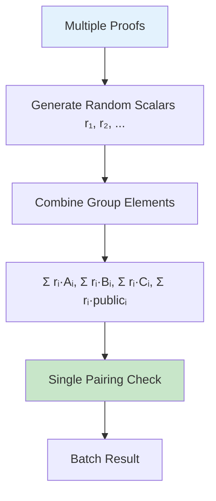
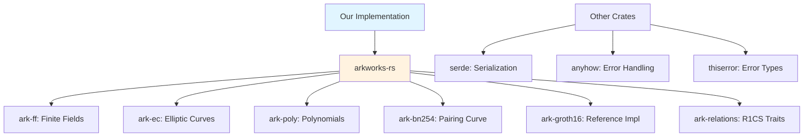

# System Architecture

This document provides comprehensive architecture diagrams for the Groth16 zk-SNARK implementation.

## Workspace Dependency Graph



**Key Relationships:**
- `math` provides foundational cryptographic primitives
- `r1cs` transforms computations into constraints
- `qap` transforms constraints into polynomials
- `groth16` orchestrates the full proving pipeline
- `circuits` demonstrates practical applications

## Data Flow: Circuit → Proof → Verify

```mermaid
flowchart LR
    A[Circuit Design] --> B[R1CS Constraints]
    B --> C[QAP Polynomials]
    C --> D[Trusted Setup]
    D --> E[Proving Key]
    D --> F[Verification Key]

    G[Private Witness] + H[Public Inputs] --> E
    E --> I[Proof Generation]
    I --> J[ZK Proof]

    J + F + H --> K[Proof Verification]
    K --> L[Valid/Invalid]

    style A fill:#e3f2fd
    style I fill:#fff3e0
    style K fill:#e8f5e9
    style J fill:#fce4ec
```

**Pipeline Stages:**
1. **Circuit Design:** Define computation as R1CS
2. **QAP Transformation:** Convert constraints to polynomials
3. **Trusted Setup:** Generate proving/verification keys
4. **Proof Generation:** Create zero-knowledge proof
5. **Verification:** Check proof validity

## Crate Module Architecture



**Module Responsibilities:**

**math crate:**
- `fields.rs`: Finite field arithmetic (addition, multiplication, inversion)
- `pairing.rs`: Elliptic curve operations and pairing computations
- `polynomial.rs`: Polynomial interpolation, evaluation, division

**r1cs crate:**
- `constraint.rs`: R1CS matrix representation (A, B, C matrices)
- `witness.rs`: Witness generation from variable assignments

**qap crate:**
- `polynomials.rs`: R1CS → QAP transformation using Lagrange interpolation

**groth16 crate:**
- `setup.rs`: Trusted setup ceremony (powers of Tau)
- `prove.rs`: Proof generation with random blinding
- `verify.rs`: Single and batch verification

**circuits crate:**
- Example circuits demonstrating practical applications
- Each circuit follows ark-relations R1CS trait

## Proof Generation Flow



**Key Observations:**
- Trusted setup happens once per circuit
- Proving key is used by prover (private)
- Verification key is public (anyone can verify)
- Verification is O(1) regardless of circuit complexity

## Verification Equation Structure



**Pairing Equation Explained:**

```
e(A, B) = e(α, β) · e(public·IC, γ) · e(C, δ)
```

Each pairing compares encrypted polynomial evaluations:
- **Left side:** Proof elements A and B
- **Right side:** Setup parameters (α, β, γ, δ) + public input

If equation holds, computation is valid with overwhelming probability.

## Circuit Examples Comparison

| Circuit | Constraints | Proof Size | Verify Time | Use Case |
|---------|-------------|------------|-------------|----------|
| multiplier | 3 | 128 bytes | 4.5ms | Privacy-preserving multiplication |
| cubic | ~10 | 128 bytes | 4.5ms | Polynomial evaluation |
| hash_preimage | ~300 | 128 bytes | 4.5ms | Password authentication |
| merkle | ~2,400 | 128 bytes | 4.5ms | Whitelist membership |
| range_proof | ~100 | 128 bytes | 4.5ms | Age verification |

**Key Insight:** Verification time is constant regardless of circuit complexity!

## Batch Verification Architecture



**Performance:**
- Individual verification: O(n) where n = number of proofs
- Batch verification: O(1) single pairing operation
- Speedup: 51× for batch of 50 proofs (4.3ms vs 223ms)

## File Organization

```
week11/
├── Cargo.toml              # Workspace configuration
├── README.md               # Project overview
├── crates/
│   ├── math/
│   │   └── src/
│   │       ├── fields.rs       # Scalar field operations
│   │       ├── pairing.rs      # Elliptic curve pairings
│   │       └── polynomial.rs   # Polynomial arithmetic
│   ├── r1cs/
│   │   └── src/
│   │       ├── constraint.rs   # R1CS matrices
│   │       └── witness.rs      # Witness generation
│   ├── qap/
│   │   └── src/
│   │       └── polynomials.rs  # R1CS→QAP transformation
│   ├── groth16/
│   │   ├── src/
│   │   │   ├── setup.rs        # Trusted setup
│   │   │   ├── prove.rs        # Proof generation
│   │   │   └── verify.rs       # Verification
│   │   └── benches/
│   │       └── batch_verify.rs # Benchmarks
│   └── circuits/
│       └── src/
│           ├── multiplier.rs
│           ├── cubic.rs
│           ├── hash_preimage.rs
│           ├── merkle.rs
│           └── range_proof.rs
└── book/
    └── src/
        └── [Tutorial chapters]
```

## External Dependencies



**Key Dependencies:**
- **arkworks-rs**: Production-ready ZK cryptography library
- **serde**: Binary serialization for keys and proofs
- **anyhow/thiserror**: Ergonomic error handling

---

**Next:** See [threat-model.md](threat-model.md) for security analysis.
