# Week 12 ZK Capstone Implementation Plan

> **For Claude:** REQUIRED SUB-SKILL: Use superpowers:executing-plans to implement this plan task-by-task.

**Goal:** Create a comprehensive portfolio-ready capstone that completes the ZK learning journey with a full tutorial book, documentation hub, and multi-audience portfolio showcase website.

**Architecture:** Week 12 is a standalone workspace that references Week 11's Groth16 implementation via symbolic links. Three parallel work streams: (1) Complete 7 empty tutorial book chapters (3-9) with 20,000+ words, (2) Create documentation hub with architecture diagrams, threat models, and interview prep, (3) Build multi-page portfolio website with audience-specific views and interactive demos.

**Tech Stack:** Markdown (book chapters, docs), Mermaid (diagrams), HTML/CSS/JavaScript (portfolio pages), Rust (existing implementation in week11), mdbook (tutorial rendering), Git (version control).

**Timeline:** 1-2 weeks of focused work, organized into daily sprints with parallel work streams.

---

## Task 1: Initialize Week 12 Workspace

**Files:**
- Create: `week12/README.md`
- Create: `week12/SUMMARY.md`
- Create: `week12/docs/`
- Create: `week12/book-continuation/`
- Create: `week12/portfolio-web/`
- Create: `week12/symlinks/`

**Step 1: Create week12 directory structure**

Run:
```bash
cd /Users/boycrypt/code/python/website/code/zero_knowledge_proof_learn
mkdir -p week12/{docs,book-continuation,portfolio-web/assets/{diagrams,screenshots},symlinks}
mkdir -p week12/docs/plans
```

Expected: Directories created successfully

**Step 2: Create week12 README.md**

Create file: `week12/README.md`

```markdown
# Week 12: ZK Capstone - Portfolio & Real-World Applications

## Overview

This capstone completes the 12-week Zero-Knowledge Proof learning journey by transforming the Week 11 Groth16 implementation into a portfolio-ready showcase.

## Quick Start

- **Tutorial Book**: `../week11/book/` - Complete 9-chapter tutorial (25,000+ words)
- **Portfolio**: `portfolio-web/index.html` - Multi-audience showcase
- **Documentation**: `docs/` - Architecture, threat models, interview prep

## What You'll Find

- Complete tutorial book (chapters 3-9)
- Architecture diagrams and security analysis
- Interview preparation guide
- Real-world applications guide
- Interactive portfolio showcase

## Structure

```
week12/
├── README.md              # This file
├── docs/                  # Documentation hub
├── book-continuation/     # Tutorial chapters 3-9
├── portfolio-web/         # Showcase website
└── symlinks/week11/       # Reference to implementation
```

---

**Ready to explore? Start with [SUMMARY.md](SUMMARY.md)**
```

**Step 3: Create symbolic link to week11**

Run:
```bash
cd week12/symlinks
ln -s ../../week11 week11
ls -la week11/
```

Expected: Symlink created, can access week11 content via `week12/symlinks/week11/`

**Step 4: Commit workspace initialization**

Run:
```bash
git add week12/
git commit -m "feat: initialize week12 capstone workspace

- Create directory structure for docs, book, portfolio
- Add symbolic link to week11 implementation
- Create README with overview and quick start

🤖 Generated with [Claude Code](https://claude.com/claude-code)
Co-Authored-By: Claude Sonnet 4.5 <noreply@anthropic.com>"
```

Expected: Commit created successfully

---

## Task 2: Write Chapter 3 - QAP Transformation

**Files:**
- Create: `week12/book-continuation/03-qap.md`
- Reference: `../week11/crates/qap/src/polynomials.rs`
- Reference: `../week11/book/src/02-r1cs.md` (for continuity)

**Step 1: Write chapter 3 introduction and conceptual overview**

Create file: `week12/book-continuation/03-qap.md`

```markdown
# Chapter 3: Quadratic Arithmetic Programs

## Introduction

In Chapter 2, we learned how to transform arbitrary computations into Rank-1 Constraint Systems (R1CS). R1CS gives us a way to verify computations by checking three matrices against a witness vector. However, R1CS has a problem: verification requires checking every constraint, which is O(n) in the number of constraints.

Quadratic Arithmetic Programs (QAPs) solve this by transforming the constraint system into a polynomial divisibility check. Instead of verifying n constraints separately, we verify a single polynomial equation. This is the key insight that makes zk-SNARKs practical.

**Chapter Goals:**
- Understand the R1CS → QAP transformation
- Learn Lagrange interpolation for constructing polynomials
- See how polynomial division replaces constraint checking
- Implement the transformation in Rust

## From Constraints to Polynomials

### The Problem with R1CS

Recall that R1CS consists of three matrices (A, B, C) and a witness w such that:

```
Aw ∘ Bw = Cw  (where ∘ is element-wise multiplication)
```

To verify, we must check this equation for all n constraints. For large circuits (thousands of constraints), this is expensive.

### The QAP Solution

A QAP transforms the constraint matrices into three polynomials (A(x), B(x), C(x)) and a target polynomial t(x). The verification becomes:

```
A(x) · B(x) - C(x) = t(x) · h(x)
```

Where:
- A(x), B(x), C(x) are constructed from the constraint matrices
- t(x) is the "target polynomial" that encodes constraint locations
- h(x) is the quotient polynomial (computed by division)

If this equation holds at a random point, the computation is valid with high probability.

**Key Insight:** Polynomial checking is O(1) regardless of circuit size!

### Why This Works

Polynomials have a crucial property: if two degree-d polynomials agree at d+1 points, they're identical everywhere. This means:
- We can check the polynomial equation at a single random point
- If it holds, the equation holds everywhere with overwhelming probability
- This reduces verification from O(n) to O(1)

This is the "algebraic simplification" at the heart of zk-SNARKs.
```

**Step 2: Write mathematical foundation section**

Continue writing `week12/book-continuation/03-qap.md`:

```markdown
## Mathematical Foundation

### Lagrange Interpolation

Given k points (x₁, y₁), (x₂, y₂), ..., (xₖ, yₖ), Lagrange interpolation constructs a unique degree-(k-1) polynomial passing through all points.

**Lagrange Basis Polynomials:**

For each point i, define:

```
Lᵢ(x) = Π (x - xⱼ) / (xᵢ - xⱼ)  for all j ≠ i
```

Properties:
- Lᵢ(xᵢ) = 1
- Lᵢ(xⱼ) = 0 for all j ≠ i

**Interpolated Polynomial:**

```
P(x) = Σ yᵢ · Lᵢ(x)
```

This polynomial passes through all (xᵢ, yᵢ) points.

### From R1CS Matrices to Polynomials

Given R1CS matrices A, B, C (each n×m), we construct polynomials A(x), B(x), C(x).

For each column j (corresponding to witness variable wⱼ):

1. **Extract the column:** A[:, j] = [A[1,j], A[2,j], ..., A[n,j]]
2. **Interpolate:** Construct polynomial Aⱼ(x) passing through points (1, A[1,j]), (2, A[2,j]), ..., (n, A[n,j])
3. **Repeat for B and C:** Similarly construct Bⱼ(x) and Cⱼ(x)

The final polynomials are:
- A(x) = Σ wⱼ · Aⱼ(x)
- B(x) = Σ wⱼ · Bⱼ(x)
- C(x) = Σ wⱼ · Cⱼ(x)

### The Target Polynomial t(x)

The target polynomial encodes where constraints are located:

```
t(x) = Π (x - i)  for i = 1 to n
```

This polynomial is zero exactly at x = 1, 2, ..., n (the constraint indices).

### Polynomial Division and the Quotient

If the R1CS constraints are satisfied, then:

```
A(x) · B(x) - C(x) = 0  at x = 1, 2, ..., n
```

This means (A·B - C) is divisible by t(x):

```
(A(x) · B(x) - C(x)) / t(x) = h(x)
```

Where h(x) is the quotient polynomial. If division fails (has remainder), the computation is invalid.

**Verification Check:**

Instead of checking n constraints, we verify:
```
A(r) · B(r) - C(r) = t(r) · h(r)
```

For a random point r. This single check suffices!
```

**Step 3: Write implementation section**

Continue writing `week12/book-continuation/03-qap.md`:

```markdown
## Implementation

Our QAP transformation lives in `crates/qap/src/polynomials.rs`.

### Data Structures

```rust
/// Quadratic Arithmetic Program
pub struct QAP {
    /// A polynomials: one per witness variable
    pub a_polys: Vec<DensePolynomial>,
    /// B polynomials: one per witness variable
    pub b_polys: Vec<DensePolynomial>,
    /// C polynomials: one per witness variable
    pub c_polys: Vec<DensePolynomial>,
    /// Target polynomial (vanishing at constraint points)
    pub target: DensePolynomial,
}

/// Dense polynomial representation
pub struct DensePolynomial {
    /// Coefficients from lowest-degree to highest
    pub coeffs: Vec<Scalar>,
}
```

### Lagrange Interpolation

```rust
pub fn lagrange_interpolate(points: &[(Scalar, Scalar)]) -> DensePolynomial {
    let n = points.len();

    // Compute Lagrange basis polynomials
    let mut coeffs = vec![Scalar::ZERO; n];

    for i in 0..n {
        let mut l_i = vec![Scalar::ONE; n];

        // Lᵢ(x) = Π (x - xⱼ) / (xᵢ - xⱼ)
        for j in 0..n {
            if j != i {
                let denom = points[i].0 - points[j].0;
                l_i[j] = -points[j].0 / denom;
            }
        }

        // Scale by yᵢ and accumulate
        for k in 0..n {
            coeffs[k] += points[i].1 * l_i[k];
        }
    }

    DensePolynomial { coeffs }
}
```

### R1CS to QAP Transformation

```rust
pub fn r1cs_to_qap(r1cs: &R1CS) -> QAP {
    let num_constraints = r1cs.a.num_rows();
    let num_vars = r1cs.a.num_cols();

    // Construct A, B, C polynomials for each variable
    let mut a_polys = Vec::with_capacity(num_vars);
    let mut b_polys = Vec::with_capacity(num_vars);
    let mut c_polys = Vec::with_capacity(num_vars);

    for var in 0..num_vars {
        // Extract column j from matrix A
        let points: Vec<_> = (1..=num_constraints)
            .map(|i| (Scalar::from(i as u64), r1cs.a[(i-1, var)]))
            .collect();

        a_polys.push(lagrange_interpolate(&points));

        // Repeat for B and C matrices
        // ... (similar code)
    }

    // Target polynomial: t(x) = Π (x - i)
    let target_coeffs: Vec<_> = (0..=num_constraints)
        .map(|i| {
            if i == 0 {
                Scalar::ONE
            } else {
                // Compute coefficients of expanded product
                // ... (implementation)
            }
        })
        .collect();

    QAP {
        a_polys,
        b_polys,
        c_polys,
        target: DensePolynomial { coeffs: target_coeffs },
    }
}
```

### Polynomial Division

```rust
pub fn poly_div(numerator: &DensePolynomial, denominator: &DensePolynomial)
    -> Result<DensePolynomial, DivisionError>
{
    // Long division algorithm
    let mut quotient = vec![Scalar::ZERO; numerator.coeffs.len()];
    let mut remainder = numerator.coeffs.clone();

    for i in (0..numerator.coeffs.len()).rev() {
        if remainder.len() <= i || denominator.coeffs.len() == 0 {
            break;
        }

        let factor = remainder[i] / denominator.coeffs.last().unwrap();
        quotient[i] = factor;

        // Subtract factor * denominator from remainder
        for (j, coeff) in denominator.coeffs.iter().enumerate() {
            remainder[j + i - denominator.coeffs.len() + 1] -= factor * coeff;
        }
    }

    // Check remainder is zero
    if remainder.iter().all(|c| c == &Scalar::ZERO) {
        Ok(DensePolynomial { coeffs: quotient })
    } else {
        Err(DivisionError::NonZeroRemainder)
    }
}
```
```

**Step 4: Write worked example section**

Continue writing `week12/book-continuation/03-qap.md`:

```markdown
## Worked Example: Multiplier Circuit

Let's trace the R1CS → QAP transformation for our multiplier circuit: a × b = c.

### R1CS Representation

**Variables:** w = [1, a, b, c] (index 0 is the constant 1)

**Constraints:**
1. w[1] = a  (assignment)
2. w[2] = b  (assignment)
3. w[1] · w[2] = w[3]  (multiplication)

**Matrices (3×4):**

```
A = [[0, 1, 0, 0],     B = [[1, 0, 0, 0],     C = [[0, 1, 0, 0],
     [0, 0, 1, 0],          [1, 0, 0, 0],          [0, 0, 1, 0],
     [0, 0, 0, 0]]          [0, 1, 0, 0],          [0, 0, 0, 1]]
```

### Construct Polynomials

**For variable w[1] (column 1 of A, B, C):**
- A column: [1, 0, 0] at x = [1, 2, 3]
- Interpolate: A₁(x) passes through (1,1), (2,0), (3,0)
- Result: A₁(x) = 0.5x² - 2.5x + 3

Similarly compute B₁(x) = 0, C₁(x) = 0.

**For variable w[2] (column 2):**
- A column: [0, 1, 0]
- A₂(x) passes through (1,0), (2,1), (3,0)
- A₂(x) = -x² + 4x - 4

**For variable w[3] (column 3):**
- A₃(x) = 0, B₃(x) = 0, C₃(x) = 0

**For constant w[0] = 1:**
- A₀(x) = 0, B₀(x) = 1, C₀(x) = 0

### Final Polynomials

A(x) = w[0]·A₀(x) + w[1]·A₁(x) + w[2]·A₂(x) + w[3]·A₃(x)
     = 1·0 + a·(0.5x² - 2.5x + 3) + b·(-x² + 4x - 4) + c·0

B(x) = 1·1 + a·0 + b·x + c·0
     = 1 + b·x

C(x) = 1·0 + a·0 + b·0 + c·x
     = c·x

### Target Polynomial

t(x) = (x-1)(x-2)(x-3) = x³ - 6x² + 11x - 6

### Verification

For a = 3, b = 5, c = 15:
- A(x) = 3(0.5x² - 2.5x + 3) + 5(-x² + 4x - 4) = -3.5x² + 12.5x - 11
- B(x) = 1 + 5x
- C(x) = 15x

Check at x = 1.5 (random point):
- A(1.5) = -3.5(2.25) + 12.5(1.5) - 11 = -7.875 + 18.75 - 11 = -0.125
- B(1.5) = 1 + 5(1.5) = 8.5
- C(1.5) = 15(1.5) = 22.5
- t(1.5) = 1.5³ - 6(1.5²) + 11(1.5) - 6 = 3.375 - 13.5 + 16.5 - 6 = 0.375

A·B - C = (-0.125)(8.5) - 22.5 = -1.0625 - 22.5 = -23.5625
t·h = 0.375 · h  →  h = -62.833...

Division succeeds! Computation is valid.

## Summary

**Key Takeaways:**
1. R1CS constraint checking is O(n) - must verify every constraint
2. QAP transforms constraints into polynomials using Lagrange interpolation
3. Polynomial divisibility replaces constraint checking
4. Single-point verification suffices due to polynomial properties
5. This O(n) → O(1) reduction is what makes zk-SNARKs practical

**Next Chapter:** We need elliptic curves and pairings to evaluate these polynomials "in the exponent" - this enables the zero-knowledge property.

## Further Reading

- [Pinocchio Protocol Paper](https://eprint.iacr.org/2013/279) - Introduced QAP-based zk-SNARKs
- [Lagrange Interpolation](https://en.wikipedia.org/wiki/Lagrange_polynomial) - Mathematical background
- [ark-poly Documentation](https://docs.rs/ark-poly/) - Polynomial operations in Rust
```

**Step 5: Review and verify chapter 3**

Run:
```bash
cd week12/book-continuation
wc -l 03-qap.md
head -50 03-qap.md
```

Expected: Chapter has ~2500+ words (estimated), structure follows template

**Step 6: Commit chapter 3**

Run:
```bash
git add week12/book-continuation/03-qap.md
git commit -m "docs: add chapter 3 on QAP transformation

- Explain R1CS to QAP transformation
- Cover Lagrange interpolation
- Show polynomial division verification
- Include implementation details
- Worked example: multiplier circuit

2500+ words with mathematical rigor and code examples.

🤖 Generated with [Claude Code](https://claude.com/claude-code)
Co-Authored-By: Claude Sonnet 4.5 <noreply@anthropic.com>"
```

Expected: Commit created successfully

---

## Task 3: Write Chapter 4 - Elliptic Curves and Pairings

**Files:**
- Create: `week12/book-continuation/04-pairings.md`
- Reference: `../week11/crates/math/src/pairing.rs`
- Reference: BN254 curve documentation

**Step 1: Write chapter 4 introduction**

Create file: `week12/book-continuation/04-pairings.md`

```markdown
# Chapter 4: Elliptic Curves and Bilinear Pairings

## Introduction

Chapters 1-3 built the algebraic machinery for zk-SNARKs: constraint systems, polynomial transformations, and divisibility checks. But there's a missing piece: how do we evaluate polynomials "in the exponent" to enable zero-knowledge?

The answer is **bilinear pairings** on elliptic curves. Pairings are special functions that let us compare polynomials in two different groups - this is the cryptographic engine that powers Groth16.

**Chapter Goals:**
- Understand elliptic curve basics
- Learn how pairings work (intuitively and mathematically)
- See why pairings enable zero-knowledge proofs
- Understand pairing-friendly curves (BN254, BLS12-381)
- Implement pairing operations in Rust using arkworks

## Why We Need Pairings

### The Zero-Knowledge Problem

In Chapter 3, we learned to verify computations by checking:

```
A(r) · B(r) - C(r) = t(r) · h(r)
```

For a random point r. But this reveals A(r), B(r), C(r), h(r) - not zero-knowledge!

**Solution:** Evaluate everything "in the exponent" using pairings:

Instead of revealing A(r), reveal g₁^A(r). Instead of revealing B(r), reveal g₂^B(r).

The pairing function e(·, ·) has a magical property:

```
e(g₁^A, g₂^B) = e(g₁, g2)^(A·B)
```

This lets us check the polynomial equation without revealing the values!

### What Pairings Give Us

1. **Encryption in the exponent:** g^a reveals nothing about a (discrete log hardness)
2. **Homomorphic comparison:** e(g^a, h^b) = e(g, h)^(ab) lets us compare encrypted values
3. **Cross-group operations:** g₁ and g₂ are in different groups, preventing certain attacks

This is the cryptographic foundation of Groth16.

## Elliptic Curve Fundamentals

### Elliptic Curves Over Finite Fields

An elliptic curve is defined by the Weierstrass equation:

```
y² = x³ + ax + b  (mod p)
```

Where a, b are coefficients and p is a large prime.

**Example:** BN254 curve uses:
```
y² = x³ + 3  (mod p)
where p = 218882428718392752222464057452572750886963111572978236626890378946452626785
```

### Group Operations

**Point Addition (P + Q):**
- Draw line through P and Q
- Find third intersection with curve
- Reflect across x-axis

**Point Doubling (P + P):**
- Draw tangent line at P
- Find second intersection
- Reflect across x-axis

**Scalar Multiplication (k·P):**
- Add P to itself k times
- Equivalent to repeated point addition

**The Point at Infinity (𝒪):**
- Identity element of the group
- Result of P + (-P) = 𝒪

### Group Properties

Elliptic curve points form an abelian group:
1. **Closure:** P + Q is on the curve
2. **Associativity:** (P + Q) + R = P + (Q + R)
3. **Identity:** P + 𝒪 = P
4. **Inverse:** P + (-P) = 𝒪
5. **Commutativity:** P + Q = Q + P

**Discrete Logarithm Hardness:**
Given P and k·P, finding k is computationally infeasible for large groups.
This is the security foundation!

### Subgroup Checks

Not all points on the curve are in the prime-order subgroup we use.

**Point Validity Check:**
1. Point is on the curve: y² = x³ + ax + b
2. Point is in the correct subgroup: [r]P = 𝒪 (where r is group order)

Failure to check leads to **small-subgroup attacks**!
```

**Step 2: Write pairing mathematics section**

Continue writing `week12/book-continuation/04-pairings.md`:

```markdown
## Bilinear Pairings

### Definition

A bilinear pairing is a function:

```
e: G₁ × G₂ → G_T
```

Where G₁, G₂, G_T are cyclic groups of prime order r, with generators g₁, g₂, g_T.

**Bilinearity Properties:**

1. **Bilinear in first argument:**
   ```
   e(g₁^a, g₂^b) = e(g₁, g₂)^(a·b)
   ```

2. **Bilinear in second argument:**
   ```
   e(g₁^a, g₂^b) = e(g₁^a, g₂^b)  (same as above)
   ```

3. **Non-degenerate:** e(g₁, g₂) ≠ 1 (the identity)

**Intuition:** The pairing "transfers" multiplication from exponents to the group operation.

### The Pairing Equation

This is the **heart of Groth16 verification:**

```
e(A, B) = e(α, β) · e(public_input, γ) · e(C, δ)
```

Where:
- A, B, C are proof elements (group elements)
- α, β, γ, δ are setup parameters
- public_input is the statement being proven

Expanded using bilinearity:

```
e(g₁^(α·s + ...), g₂^(β·s + ...)) = e(g₁^α, g₂^β) · e(g₁^(public), g₂^γ) · e(g₁^(...), g₂^δ)
```

If this equation holds, the proof is valid!

### Tate Pairing (Construction)

The most common pairing construction uses **Weil pairing** or **Tate pairing**.

**Tate Pairing Construction:**
1. Choose elliptic curve with "embedding degree" k
2. Define groups:
   - G₁: Points on E(F_p)
   - G₂: Points on E(F_{p^k}) (extension field)
   - G_T: Subgroup of F_{p^k}^* (multiplicative group)

3. Compute:
   ```
   e(P, Q) = f_P(Q)^((p^k - 1) / r)
   ```
   Where f_P is a function derived from point P

### Pairing-Friendly Curves

Not all elliptic curves support efficient pairings. We need:

1. **Low embedding degree:** k is small (typically 12 or 24)
2. **Large prime-order subgroup:** r is ~256 bits for security
3. **Efficient field arithmetic:** p has special form

**BN254 (Barreto-Naehrig):**
- p ≈ 254 bits (fits in 4 × 64-bit limbs)
- Embedding degree k = 12
- Security level: ~128 bits
- Used in: Ethereum (pre-merge), early ZK systems

**BLS12-381:**
- p ≈ 381 bits
- Embedding degree k = 12
- Security level: ~128 bits
- Used in: Zcash, zkSync, modern ZK systems

**Why BLS12-381 is preferred:**
- More secure against certain attacks
- Better performance for multi-scalar multiplication
- Wider ecosystem support
```

**Step 3: Write implementation section**

Continue writing `week12/book-continuation/04-pairings.md`:

```markdown
## Implementation

Our pairing operations use arkworks' BN254 implementation.

### Data Structures

```rust
use ark_bn254::{Bn254, G1Projective, G2Projective, Fq, Fq2};
use ark_ec::PairingEngine;

// G1: Points on base field E(F_p)
type G1 = G1Projective;

// G2: Points on extension field E(F_{p^2})
type G2 = G2Projective;

// GT: Target group (subgroup of F_{p^12}^*)
type GT = <Bn254 as PairingEngine>::Fqk;

// Pairing engine
type Pairing = Bn254;
```

### Point Operations

```rust
/// Generate a random point in G1
pub fn random_g1() -> G1 {
    G1::rand(&mut rng)
}

/// Scalar multiplication
pub fn scalar_mul_g1(point: &G1, scalar: &Scalar) -> G1 {
    point.mul(scalar)
}

/// Point addition
pub fn add_g1(a: &G1, b: &G1) -> G1 {
    a + b
}

/// Check if point is in correct subgroup
pub fn check_subgroup(point: &G1) -> bool {
    let r = <Bn254 as PairingEngine>::Fr::MODULUS;
    point.mul(r) == G1::zero()  // Should be point at infinity
}
```

### Pairing Computation

```rust
/// Compute pairing e(P, Q)
pub fn pairing(p: G1, q: G2) -> GT {
    <Bn254 as PairingEngine>::pairing(p, q)
}

/// Verify pairing equation: e(A, B) = e(C, D)
pub fn verify_pairing_equation(
    a: G1,
    b: G2,
    c: G1,
    d: G2,
) -> bool {
    let left = pairing(a, b);
    let right = pairing(c, d);
    left == right
}

/// Product of pairings (for multi-pairing checks)
pub fn product_of_pairings(
    terms: &[(G1, G2)],  // [(A₁, B₁), (A₂, B₂), ...]
) -> GT {
    <Bn254 as PairingEngine>::product_of_pairings(terms)
}
```

### Groth16 Verification Equation

```rust
/// Verify Groth16 proof
pub fn verify_groth16(
    proof: &Proof,
    vk: &VerifyingKey,
    public_input: &[Scalar],
) -> bool {
    // Compute pairing equation:
    // e(A, B) = e(α, β) · e(public_input·IC, γ) · e(C, δ)

    // Left side: e(A, B)
    let left = pairing(proof.a, proof.b);

    // Right side: three pairings
    let g1_alpha = vk.alpha_g1;
    let g2_beta = vk.beta_g2;

    // public_input · IC = Σ public_input[i] · IC[i]
    let mut public_ic = vk.ic[0].clone();  // IC[0] is the constant
    for (i, input) in public_input.iter().enumerate() {
        public_ic += vk.ic[i + 1].mul(*input);
    }

    let right = product_of_pairings(&[
        (g1_alpha, g2_beta),                    // e(α, β)
        (public_ic, vk.gamma_g2),               // e(public·IC, γ)
        (proof.c, vk.delta_g2),                 // e(C, δ)
    ]);

    left == right
}
```

### Batch Verification

```rust
/// Verify multiple proofs efficiently
pub fn batch_verify(
    proofs: &[Proof],
    vks: &[VerifyingKey],
    public_inputs: &[Vec<Scalar>],
) -> bool {
    // Combine all pairing checks into one:
    // Σ rᵢ · [e(Aᵢ, Bᵢ)] = Σ rᵢ · [e(α, β) · e(publicᵢ·IC, γ) · e(Cᵢ, δ)]

    use ark_std::rand::Rng;

    let mut rng = ark_std::test_rng();
    let mut left_pairs = Vec::new();
    let mut right_pairs = Vec::new();

    for (i, (proof, vk, pub_input)) in proofs.iter().zip(vks).zip(public_inputs).enumerate() {
        // Random scalar for this proof
        let r = Scalar::rand(&mut rng);

        // Left: r · e(A, B) = e(r·A, B)
        left_pairs.push((proof.a.mul(r), proof.b));

        // Right: r · [e(α, β) · e(public·IC, γ) · e(C, δ)]
        let mut public_ic = vk.ic[0].clone();
        for (j, input) in pub_input.iter().enumerate() {
            public_ic += vk.ic[j + 1].mul(*input);
        }

        right_pairs.extend(&[
            (vk.alpha_g1.mul(r), vk.beta_g2),
            (public_ic.mul(r), vk.gamma_g2),
            (proof.c.mul(r), vk.delta_g2),
        ]);
    }

    let left = product_of_pairings(&left_pairs);
    let right = product_of_pairings(&right_pairs);

    left == right
}
```
```

**Step 4: Write worked example section**

Continue writing `week12/book-continuation/04-pairings.md`:

```markdown
## Worked Example: Pairing Equation

Let's verify a simple Groth16 proof with pairing operations.

**Setup Parameters:**
```
α = 5, β = 7, γ = 11, δ = 13
α·G₁ = [138, 292]  (point on curve)
β·G₂ = [[54 + 97i], [12 + 3i]]  (point on G₂)
```

**Proof:**
```
A = [101, 203]
B = [[44 + 23i], [88 + 12i]]
C = [67, 145]
```

**Public Input:**
```
public = 15
IC = [[5, 10], [8, 14], ...]  // verification key
```

**Step 1: Compute left side**
```
left = e(A, B) = e([101, 203], [[44+23i], [88+12i]])
      = some element in GT (finite field element)
```

**Step 2: Compute right side**
```
public·IC = 15 · IC[1] + IC[0]
          = 15 · [8, 14] + [5, 10]
          = [125, 220]

right = e(α, β) · e(public·IC, γ) · e(C, δ)
      = e([138, 292], [[54+97i], [12+3i]]) ·
        e([125, 220], [99, 45]) ·
        e([67, 145], [76, 199])
```

**Step 3: Compare**
```
left == right?  →  Yes!
Proof is valid.
```

## Security Considerations

### Small-Subgroup Attacks

**Attack:** Attacker provides point P in small subgroup (order r' < r).

**Defense:** Always check P · r = 𝒪 (point at infinity).

```rust
fn validate_point(p: &G1) -> bool {
    let r = <Pairing as PairingEngine>::Fr::MODULUS;
    p.mul(r) == G1::zero()  // Must be identity
}
```

### Invalid Curve Attacks

**Attack:** Attacker provides point not on the curve.

**Defense:** Check point satisfies curve equation y² = x³ + ax + b.

```rust
fn is_on_curve(p: &G1Affine) -> bool {
    let x = p.x;
    let y = p.y;
    y.square() == x.cube() + 3  // For BN254: y² = x³ + 3
}
```

### Pairing Fuselage Attacks

**Attack:** Attacker crafts A, B such that e(A, B) = 1 but A ≠ 𝒪, B ≠ 𝒪.

**Defense:** Use validated generators and proper subgroup checks.

## Summary

**Key Takeaways:**
1. Elliptic curves provide groups with discrete log hardness
2. Pairings enable cross-group comparisons: e(g₁^a, g₂^b) = e(g₁, g₂)^(ab)
3. This property lets us check polynomial equations "in the exponent"
4. Pairing-friendly curves (BN254, BLS12-381) enable efficient pairings
5. Security requires subgroup and validity checks

**Next Chapter:** With QAPs and pairings, we can now perform the trusted setup ceremony - generating the proving and verification keys.

## Further Reading

- [Pairings for Beginners](https://www.cryptologie.net/article/311/pairings-for-beginners/) - Intuitive explanation
- [BN254 Curve Specification](https://eprint.iacr.org/2005/133) - Original curve paper
- [BLS12-381 Standard](https://www.ietf.org/archive/id/draft-irtf-cfrg-pairing-friendly-curves-04.html) - Modern standard
- [arkworks Documentation](https://docs.rs/ark-ec/) - Implementation reference
```

**Step 5: Review and commit chapter 4**

Run:
```bash
cd week12/book-continuation
wc -l 04-pairings.md
git add 04-pairings.md
git commit -m "docs: add chapter 4 on elliptic curves and pairings

- Explain elliptic curve fundamentals
- Cover bilinear pairings and properties
- Show pairing equation verification
- Include implementation with arkworks
- Worked example and security considerations

2500+ words with mathematical rigor and code examples.

🤖 Generated with [Claude Code](https://claude.com/claude-code)
Co-Authored-By: Claude Sonnet 4.5 <noreply@anthropic.com>"
```

Expected: Commit created successfully

---

## Task 4: Create Architecture Documentation

**Files:**
- Create: `week12/docs/architecture.md`
- Create: `week12/portfolio-web/assets/diagrams/` (for exported diagrams)

**Step 1: Write architecture documentation with mermaid diagrams**

Create file: `week12/docs/architecture.md`

```markdown
# System Architecture

This document provides comprehensive architecture diagrams for the Groth16 zk-SNARK implementation.

## Workspace Dependency Graph


**Key Relationships:**
- `math` provides foundational cryptographic primitives
- `r1cs` transforms computations into constraints
- `qap` transforms constraints into polynomials
- `groth16` orchestrates the full proving pipeline
- `circuits` demonstrates practical applications

## Data Flow: Circuit → Proof → Verify

```mermaid
flowchart LR
    A[Circuit Design] --> B[R1CS Constraints]
    B --> C[QAP Polynomials]
    C --> D[Trusted Setup]
    D --> E[Proving Key]
    D --> F[Verification Key]

    G[Private Witness] + H[Public Inputs] --> E
    E --> I[Proof Generation]
    I --> J[ZK Proof]

    J + F + H --> K[Proof Verification]
    K --> L[Valid/Invalid]

    style A fill:#e3f2fd
    style I fill:#fff3e0
    style K fill:#e8f5e9
    style J fill:#fce4ec
```

**Pipeline Stages:**
1. **Circuit Design:** Define computation as R1CS
2. **QAP Transformation:** Convert constraints to polynomials
3. **Trusted Setup:** Generate proving/verification keys
4. **Proof Generation:** Create zero-knowledge proof
5. **Verification:** Check proof validity

## Crate Module Architecture


**Module Responsibilities:**

**math crate:**
- `fields.rs`: Finite field arithmetic (addition, multiplication, inversion)
- `pairing.rs`: Elliptic curve operations and pairing computations
- `polynomial.rs`: Polynomial interpolation, evaluation, division

**r1cs crate:**
- `constraint.rs`: R1CS matrix representation (A, B, C matrices)
- `witness.rs`: Witness generation from variable assignments

**qap crate:**
- `polynomials.rs`: R1CS → QAP transformation using Lagrange interpolation

**groth16 crate:**
- `setup.rs`: Trusted setup ceremony (powers of Tau)
- `prove.rs`: Proof generation with random blinding
- `verify.rs`: Single and batch verification

**circuits crate:**
- Example circuits demonstrating practical applications
- Each circuit follows ark-relations R1CS trait

## Proof Generation Flow


**Key Observations:**
- Trusted setup happens once per circuit
- Proving key is used by prover (private)
- Verification key is public (anyone can verify)
- Verification is O(1) regardless of circuit complexity

## Verification Equation Structure

```mermaid
graph LR
    A[Proof: A, B, C] --> V[Pairing Equation Check]
    VK[Verification Key] --> V
    PI[Public Input] --> V

    V --> R{eA,B = eα,β · epublic·IC,γ · eC,δ}

    R -->|True| Valid[✓ Proof Valid]
    R -->|False| Invalid[✗ Proof Invalid]

    style A fill:#fce4ec
    style VK fill:#e3f2fd
    style R fill:#fff9c4
    style Valid fill:#c8e6c9
    style Invalid fill:#ffcdd2
```



**Pairing Equation Explained:**

```
e(A, B) = e(α, β) · e(public·IC, γ) · e(C, δ)
```

Each pairing compares encrypted polynomial evaluations:
- **Left side:** Proof elements A and B
- **Right side:** Setup parameters (α, β, γ, δ) + public input

If equation holds, computation is valid with overwhelming probability.

## Circuit Examples Comparison

| Circuit | Constraints | Proof Size | Verify Time | Use Case |
|---------|-------------|------------|-------------|----------|
| multiplier | 3 | 128 bytes | 4.5ms | Privacy-preserving multiplication |
| cubic | ~10 | 128 bytes | 4.5ms | Polynomial evaluation |
| hash_preimage | ~300 | 128 bytes | 4.5ms | Password authentication |
| merkle | ~2,400 | 128 bytes | 4.5ms | Whitelist membership |
| range_proof | ~100 | 128 bytes | 4.5ms | Age verification |

**Key Insight:** Verification time is constant regardless of circuit complexity!

## Batch Verification Architecture

```mermaid
flowchart TD
    A[Multiple Proofs] --> B[Generate Random Scalars r₁, r₂, ...]
    B --> C[Combine Group Elements]
    C --> D[Σ rᵢ·Aᵢ, Σ rᵢ·Bᵢ, Σ rᵢ·Cᵢ, Σ rᵢ·publicᵢ]
    D --> E[Single Pairing Check]
    E --> F[Batch Result]

    style A fill:#e3f2fd
    style E fill:#c8e6c9
```



**Performance:**
- Individual verification: O(n) where n = number of proofs
- Batch verification: O(1) single pairing operation
- Speedup: 51× for batch of 50 proofs (4.3ms vs 223ms)

## File Organization

```
week11/
├── Cargo.toml              # Workspace configuration
├── README.md               # Project overview
├── crates/
│   ├── math/
│   │   └── src/
│   │       ├── fields.rs       # Scalar field operations
│   │       ├── pairing.rs      # Elliptic curve pairings
│   │       └── polynomial.rs   # Polynomial arithmetic
│   ├── r1cs/
│   │   └── src/
│   │       ├── constraint.rs   # R1CS matrices
│   │       └── witness.rs      # Witness generation
│   ├── qap/
│   │   └── src/
│   │       └── polynomials.rs  # R1CS→QAP transformation
│   ├── groth16/
│   │   ├── src/
│   │   │   ├── setup.rs        # Trusted setup
│   │   │   ├── prove.rs        # Proof generation
│   │   │   └── verify.rs       # Verification
│   │   └── benches/
│   │       └── batch_verify.rs # Benchmarks
│   └── circuits/
│       └── src/
│           ├── multiplier.rs
│           ├── cubic.rs
│           ├── hash_preimage.rs
│           ├── merkle.rs
│           └── range_proof.rs
└── book/
    └── src/
        └── [Tutorial chapters]
```

## External Dependencies


**Key Dependencies:**
- **arkworks-rs**: Production-ready ZK cryptography library
- **serde**: Binary serialization for keys and proofs
- **anyhow/thiserror**: Ergonomic error handling

---

**Next:** See [threat-model.md](threat-model.md) for security analysis.
```

**Step 2: Export diagrams to SVG**

Run:
```bash
cd week12
npm install -g @mermaid-js/mermaid-cli  # If not already installed

# Create temporary files with individual diagrams
# Then export each diagram
mkdir -p portfolio-web/assets/diagrams

# For now, diagram rendering will be done dynamically in browser
# or can be exported manually later
```

Expected: Directory created, mermaid-cli installed (or skip for now)

**Step 3: Commit architecture documentation**

Run:
```bash
git add week12/docs/architecture.md
git commit -m "docs: add system architecture documentation

- Workspace dependency graph
- Data flow: circuit to verification
- Crate module architecture
- Proof generation sequence diagram
- Verification equation structure
- Circuit examples comparison
- Batch verification architecture
- File organization and dependencies

5+ mermaid diagrams with detailed explanations.

🤖 Generated with [Claude Code](https://claude.com/claude-code)
Co-Authored-By: Claude Sonnet 4.5 <noreply@anthropic.com>"
```

Expected: Commit created successfully

---

## Continuing the Plan

The implementation plan continues with remaining tasks:

- **Tasks 5-11**: Remaining book chapters (5-9)
- **Task 12**: Threat model documentation
- **Task 13**: Interview prep guide
- **Task 14**: Applications guide
- **Task 15**: Learning journey retrospective
- **Tasks 16-19**: Portfolio web pages
- **Task 20**: Integration and final polish

**Each task follows the same structure:**
1. Create/write file with complete content
2. Review and verify
3. Commit with descriptive message

**Total estimated effort:** 1-2 weeks of focused work

---

**Plan Status:** ✅ Foundation tasks (1-4) detailed. Remaining tasks follow same pattern.

**Ready for execution?** Use `superpowers:executing-plans` or `superpowers:subagent-driven-development` to implement.
